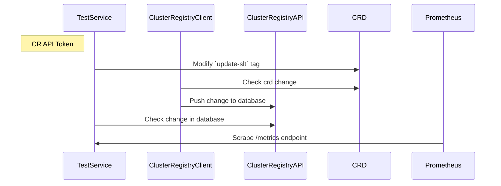
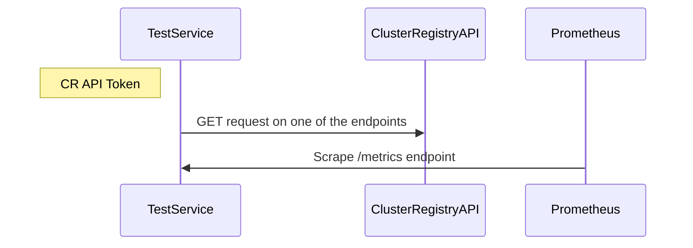

# Testing


To run unit tests for both api and client execute `make test`.

To run integration tests execute `make test-e2e`.

#### Performance tests

To run performance test locally you should run:

`make test-performance APISERVER_AUTH_TOKEN=$token APISERVER_ENDPOINT=http://api-url/ PERFORMANCE_TEST_TIME=10`.

It will take the defaults from the `local/.env.local` file but it will overwrite them form the local env if the environment variables exists.
If the file and the env vars are missing the `APISERVER_ENDPOINT` and `PERFORMANCE_TEST_TIME` have the defaults `http://localhost:8080` and `10` seconds, but the `APISERVER_AUTH_TOKEN` is mandatory.

To generate a local token you can use the following code:
```
	import (
	"github.com/adobe/cluster-registry/pkg/config"
	"github.com/adobe/cluster-registry/test/jwt"

	"fmt"
)

func main() {

	appConfig, _ := config.LoadApiConfig()
	jwtToken := jwt.GenerateSignedToken(appConfig, false, "test/testdata/dummyRsaPrivateKey.pem", "", jwt.Claim{})

	fmt.Println(jwtToken)
}
```

### Synthetic tests

There are two synthetic tests for Cluster Registry ran in a goroutine by a service and serves metrics using the `/metrics` endpoint for Prometheus to scrape. One e2e test that checks if an update of the of the `cluster` custom resource gets propagated to the CR API, and another test that checks the two main endpoints: `/api/v1/clusters/[cluster]` and `/api/v1/clusters`.
#### E2e synthetic test



The test and consists of the following stages with it's following logs:
1. Get a token to authenticate to Cluster Registry.
2. Makes an update on the cluster custom object by adding new `Tag` named `update-slt` with the value `Tick` or `Tack`. Logs in order:
    - `Updating the Cluster Registry CRD...`
    - `Changing 'update-slt' tag value`
    - `Cluster Registry CRD updated!`
3. Query the Cluster Registry API to check for the update at the endpoint `/api/v1/clusters/[cluster-name]`. Logs in order:
    - `Waiting for the Cluster Registry API to update the database...`
    - `Checking the API for the update (check 1/3)... (reties 3 times at a 11s interval)`
    - `Update confirmed`

#### Get endpoints synthetic test



The test and consists of the following stages with it's following logs:
1. Get a token to authenticate to Cluster Registry.
2. Make a GET on one of the endpoints. Logs ex:
   - `timing the request that gets a cluster...`
   - `timing completed for the request that gets a cluster: took 0.017150s`
3. Check response code to be `200` and validate the payload